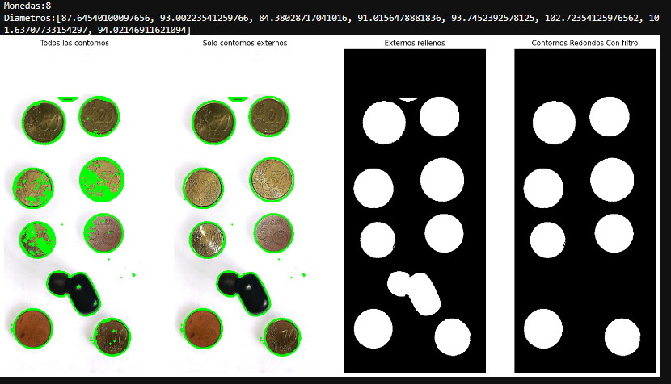
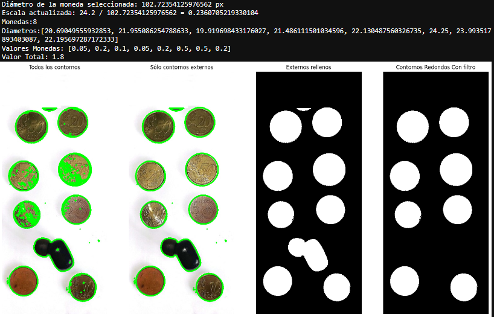
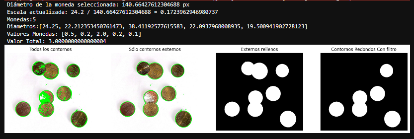
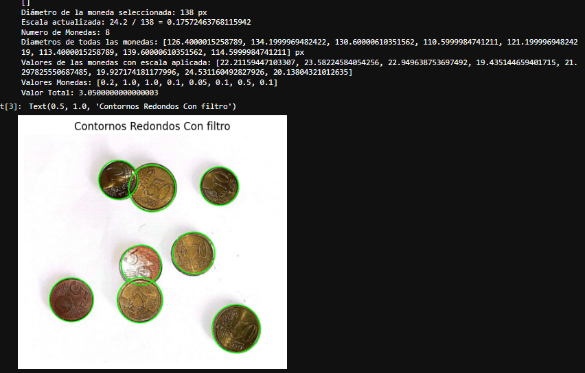
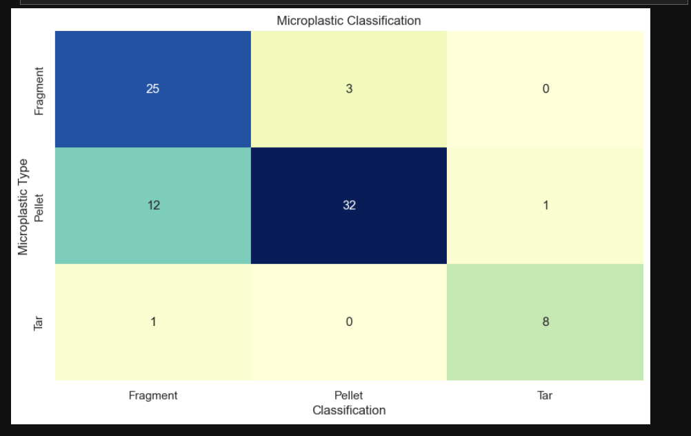

# Práctica 3 Resultados

## Tarea 1: Filtrado de Contornos en una Imagen de Monedas

**Descripción:**

En esta tarea, se lleva a cabo el procesamiento de una imagen que contiene monedas, con el objetivo de filtrar los contornos que corresponden a monedas y mostrar el número total de monedas presentes en la imagen. Para realizar esto, se siguen los siguientes pasos:

1. Se lee la imagen y se la convierte a escala de grises.

2. Se aplica un umbral para obtener una imagen binaria que destaque los objetos.

3. Se encuentran todos los contornos en la imagen, tanto los externos como los internos.

4. Se obtienen únicamente los contornos externos, que corresponden a las monedas.

5. Se dibujan los contornos tanto en la imagen original como en una imagen vacía.

6. Se calcula la relación entre el área y el cuadrado del perímetro de cada contorno para filtrar las monedas, considerando un umbral de redondez.

7. Se determina el valor de cada moneda en función de su diámetro.

8. Se muestra la cantidad total de monedas y sus diámetros.

**Resultados:**

Se muestra una imagen con los contornos externos, una imagen con los contornos externos rellenos y una imagen con los contornos redondos después de aplicar el filtro de redondez. Además, se imprime el número total de monedas en la imagen y los diámetros de las monedas detectadas.

**Número de Monedas:** 8

**Diametros:** [87.64540100097656, 93.00223541259766, 84.38028717041016, 91.0156478881836, 93.7452392578125, 102.72354125976562, 101.63707733154297, 94.02146911621094]

## Tarea 2: Cálculo de Cantidad de Dinero en Imágenes de Monedas

**Descripción:**

En esta tarea, se procesan imágenes de monedas que pueden contener monedas solapadas y no solapadas. El objetivo es identificar una moneda de un euro en la imagen y calcular la cantidad total de dinero presente en la imagen.

Se proporcionan dos versiones de la tarea: una sin el uso de HoughCircles y otra con HoughCircles. En ambas versiones, se sigue el siguiente proceso:

1. Se lee la imagen y se aplica un procesamiento previo, que incluye la conversión a escala de grises y suavizado.

2. En la versión sin HoughCircles, se permite al usuario seleccionar una moneda haciendo clic en ella, lo que actualiza la escala utilizada para calcular los valores de las monedas. Además, se almacenan los diámetros de todas las monedas en una lista.

3. En la versión con HoughCircles, se detectan automáticamente los círculos en la imagen, se selecciona uno de ellos y se calcula la escala y los diámetros de todas las monedas detectadas.

4. Se calcula el valor correspondiente a cada moneda en función de su diámetro y se suma para obtener el valor total de dinero en la imagen.

**Resultados:**

Se muestra la imagen con los contornos redondos después de aplicar el filtro de redondez en la versión sin HoughCircles. En ambas versiones, se imprime el diámetro de la moneda seleccionada, la escala actualizada, el número de monedas detectadas, los diámetros de todas las monedas y los valores correspondientes de las monedas. Finalmente, se muestra el valor total de dinero en la imagen.

### **Versión 1: SIN HOUGH**
#### Caso 1

#### Caso 2

#### Caso 3

### **Versión 2: CON HOUGH**
#### Caso 3 con Hough

### Principales Problemas Observados:

Dependencia de la Precisión Debido a la Calidad de la Imagen: La precisión de la detección de monedas y el cálculo de su valor dependen en gran medida de la calidad de la imagen. Imágenes borrosas o con baja resolución pueden afectar la precisión.

Identificación Individual de Objetos Solapados: En imágenes con monedas solapadas, puede ser difícil identificar y medir individualmente cada moneda. En estas situaciones, se necesitan enfoques más avanzados para separar y medir las monedas de manera precisa.

# Clasificación de Microplásticos

Este repositorio contiene código y datos relacionados con la clasificación de microplásticos en imágenes utilizando propiedades geométricas. El trabajo se basa en el artículo "SMACC: A System for Microplastics Automatic Counting and Classification" y utiliza una variedad de características geométricas para clasificar microplásticos en tres categorías: Tar, Pellet y Fragment.

##  Tarea 3: Determina patrones geométricos para cada una de las tres clases y evalúa los aciertos y fallos con las imágenes completas la matriz de confusión

### Extracción de características geométricas

Hemos extraído características geométricas de las imágenes de microplásticos. Algunas de las características que hemos calculado son:

- Área en píxeles.
- Perímetro en píxeles.
- Compacidad (relación del cuadrado del perímetro con el área).
- Relación del área con el del contenedor.
- Relación del ancho y el alto del contenedor.
- Relación entre los ejes de la elipse ajustada.
- Definido el centroide, relación entre las distancias menor y mayor al contorno.

### Clasificación de microplásticos

Hemos clasificado los microplásticos en tres categorías: Tar, Pellet y Fragment. Para cada categoría, hemos determinado umbrales específicos para las características geométricas, como la relación de aspecto, el área y la longitud del eje mayor de la elipse ajustada.

### Evaluación de la clasificación

Hemos evaluado la clasificación de microplásticos mediante una matriz de confusión. La matriz de confusión muestra el comportamiento del clasificador para las distintas categorías y nos permite determinar el número de muestras clasificadas correctamente y el número de muestras clasificadas incorrectamente para cada categoría.

## Resultados
Hemos calculado las métricas de clasificación y mostrado los resultados en una matriz de confusión y un mapa de calor. Los resultados muestran cuántas muestras se clasificaron correctamente en cada categoría y cuántas se clasificaron incorrectamente.

## Requisitos especificos para esta ultima parte 

Para ejecutar el código, necesitará las siguientes bibliotecas de Python:
- OpenCV
- NumPy
- Matplotlib
- Seaborn
- Pandas

